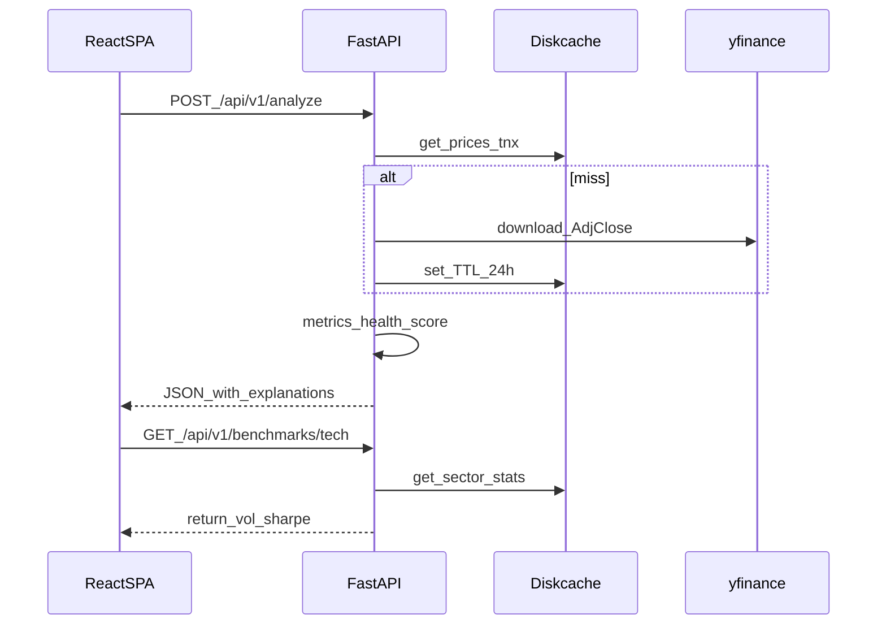

# RiskLab v1 Implementation Plan

> **For agentic workers:** Use task-by-task execution with verification gates. Commit only when the user explicitly asks.

**Goal:** Ship a GitHub-ready, zero-cost full-stack Portfolio Risk Analytics Engine that analyzes weight-based portfolios, returns plain-English metrics + Health Score, caches sector benchmarks, and runs via `docker-compose up`.

**Architecture:** Modular FastAPI monolith (market data → metrics → health score → benchmarks) with Diskcache TTL; React SPA consumes three REST endpoints. No PyPortfolioOpt in v1.

**Tech Stack:** Python 3.11+, FastAPI, Uvicorn, Pandas, NumPy, SciPy, yfinance, Diskcache, Pydantic; React 18+, Vite, TypeScript, TailwindCSS, Lucide, Recharts; Docker Compose; GitHub Actions.

## Locked decisions

- **v1 scope:** analyze + benchmarks + healthcheck; weights-only UI; no shares mode; no optimize API/UI
- **v2 trigger:** user prompt `"make v2"` → add PyPortfolioOpt + `POST /api/v1/optimize` + Suggested allocation panel
- **Risk-free:** live `^TNX` via yfinance, fallback `0.045`; optional request override
- **Charts:** Recharts
- **Cache:** Diskcache, 24h TTL for prices, TNX, and sector ETF stats
- **Sectors:** `tech→XLK`, `healthcare→XLV`, `energy→XLE`, `financials→XLF`, `consumer→XLY`
- **UI look:** slate canvas + faint grid, IBM Plex Sans/Mono, teal accent; avoid purple/cream/AI-slop patterns
- **Deps:** Socket `depscore` scanned (OK to proceed); re-scan after pinning versions in manifests

## Target repo layout

```text
RiskLab/
├── .github/workflows/ci.yml
├── docs/superpowers/specs/2026-07-21-risklab-design.md
├── docs/superpowers/plans/2026-07-21-risklab-v1.md
├── backend/app/{main.py,api/,core/,services/,schemas/}
├── backend/tests/
├── backend/{requirements.txt,Dockerfile}
├── frontend/src/{components/,hooks/,types/,lib/}
├── frontend/{package.json,Dockerfile}
├── docker-compose.yml
├── .gitignore
├── LICENSE
└── README.md
```

## Data flow



---

### Task 0: Design + plan docs on disk

- Create [`docs/superpowers/specs/2026-07-21-risklab-design.md`](docs/superpowers/specs/2026-07-21-risklab-design.md) capturing approved architecture, metrics, API, UI, and v2 deferral
- Persist this plan to [`docs/superpowers/plans/2026-07-21-risklab-v1.md`](docs/superpowers/plans/2026-07-21-risklab-v1.md)
- Spec self-review: no TBDs; v1/v2 boundary explicit; weight convention `[0,1]` sum≈1

### Task 1: Backend scaffold + config + cache

**Files:** `backend/app/main.py`, `backend/app/core/config.py`, `backend/app/core/cache.py`, `backend/requirements.txt`, `backend/Dockerfile`

- Settings via pydantic-settings: `CACHE_DIR`, `CACHE_TTL_SECONDS=86400`, `RISK_FREE_FALLBACK=0.045`, CORS for Vite
- Diskcache wrapper: `get/set` with TTL; health probe (writable)
- FastAPI app mounts routers; `GET /api/v1/health` returns `{status, cache_ok}`
- **Verify:** `uvicorn` boots; health returns 200
- **Socket:** pin versions in `requirements.txt`, re-run `depscore` on pins; stop if any score is critically low and ask user

### Task 2: Pydantic schemas + plain-English catalog

**Files:** `backend/app/schemas/portfolio.py`, `backend/app/services/explanations.py`

- Request: `Holding {ticker, weight}`, `AnalyzeRequest {holdings, total_value, lookback_years: 1|2|3, risk_free_rate?: float}`
- Response models: each metric as `{value, explanation}`; health `{score, tier, summary, factors}`; matrices/series for charts
- Centralized explanation strings matching the product copy (volatility, Sharpe, Sortino, VaR, CVaR, MDD, correlation, HHI, beta, health)

### Task 3: Market data service (TDD with mocks)

**Files:** `backend/app/services/market_data.py`, `backend/tests/test_market_data.py`

- `fetch_prices(tickers, start, end) -> DataFrame` Adj Close; cache key `prices:{sorted}:{start}:{end}`
- `fetch_risk_free_rate() -> (rate, source)` from `^TNX`/100 or fallback
- Unit tests mock yfinance; assert cache hit skips network
- Invalid/empty tickers raise domain error mapped to HTTP 400

### Task 4: Risk metrics engine (TDD, fixture returns)

**Files:** `backend/app/services/metrics.py`, `backend/tests/test_metrics.py`

Pure functions on numpy/pandas (no network):

- Portfolio daily log returns from weighted assets
- Ann. vol, Sharpe, Sortino, historical+parametric VaR (1d/30d @ 95/99), CVaR, MDD, correlation, HHI, beta vs market
- Dollar VaR/CVaR scaled by `total_value`
- Tests use synthetic return series with known analytic expectations (tolerance)

### Task 5: Health score service (TDD)

**Files:** `backend/app/services/health_score.py`, `backend/tests/test_health_score.py`

- Composite: Sharpe 30% + Diversification/HHI 25% + MDD 25% + Beta stability 20%
- Factor maps: Sharpe `[-0.5,2]→[0,100]`; HHI inverted vs equal-weight baseline; |MDD| `[0,0.5]→[100,0]`; `|β−1|` penalized
- Tier labels + one-sentence summary
- Tests cover Excellent vs High Vulnerability extremes

### Task 6: Benchmark service + analyze orchestration

**Files:** `backend/app/services/benchmarks.py`, `backend/app/services/analyze.py`, `backend/app/api/routes.py`, tests

- Sector ETF map; compute/cache return, vol, Sharpe for lookback
- `analyze_portfolio()` wires market → metrics → health → chart series (cum return vs `^GSPC`) + radar points vs all sectors
- Routes: `POST /api/v1/analyze`, `GET /api/v1/benchmarks/{sector}`, `GET /api/v1/health`
- API tests with `TestClient` + mocked market layer

### Task 7: Frontend scaffold + types + API hook

**Files:** `frontend/` Vite React-TS, Tailwind, proxy `/api→http://backend:8000` (compose) / `localhost:8000` (dev)

- Types mirroring backend response
- `useAnalyze` mutation/hook with fetch + toast-ready error mapping
- Weight helper: normalize to sum 1 when auto-rebalance on
- **Socket:** `depscore` on `package.json` deps after install; prefer native `fetch` (no axios)

### Task 8: Input form + dashboard UI

**Files:** `frontend/src/components/{PortfolioForm,HealthBadge,MetricCard,charts/*}.tsx`, `App.tsx`

- Form: dynamic rows, sliders, auto-rebalance toggle, total value, lookback, Analyze
- Health badge + factor breakdown; metric cards with `?` tooltips from API explanations
- Charts: CorrelationHeatmap, AllocationDonut, CumulativeReturnChart, BenchmarkRadar
- Toast notifications for errors
- **Verify:** `npm run build` + ESLint clean

### Task 9: Docker, CI, LICENSE, README

**Files:** root `docker-compose.yml`, both Dockerfiles, `.github/workflows/ci.yml`, `.gitignore`, `LICENSE` (MIT), `README.md`

- Compose: backend `:8000`, frontend `:5173`, shared volume for cache optional
- CI: backend Pytest; frontend lint + `tsc` + build
- README: quickstart (`docker-compose up`), local dev, metrics glossary, API overview, **v2 roadmap note**
- End-to-end smoke: compose up + curl analyze with mocked or live network (document live yfinance dependency)

### Task 10: Final verification gate

- Full Pytest suite green
- Frontend build green
- Socket re-scan of final pinned deps — alert user if any score is low
- Manual checklist: OpenAPI at `/docs`, health endpoint, sample 3-ticker analyze payload renders dashboard

## Out of scope (v1)

- PyPortfolioOpt / optimize endpoint / suggested weights UI (**v2**)
- Share-count input mode
- Auth, cloud DB, paid market-data vendors
